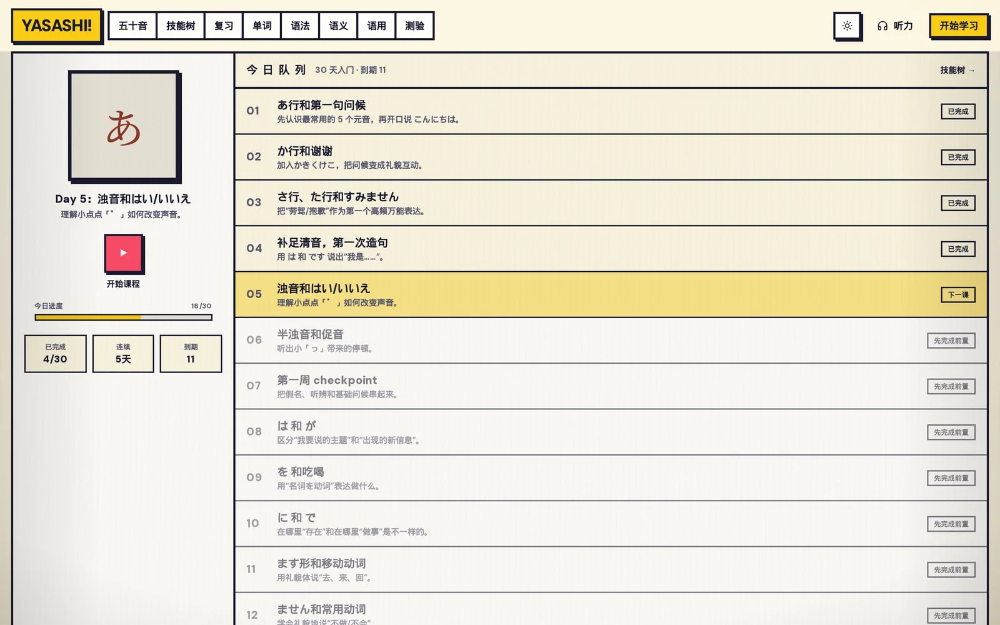
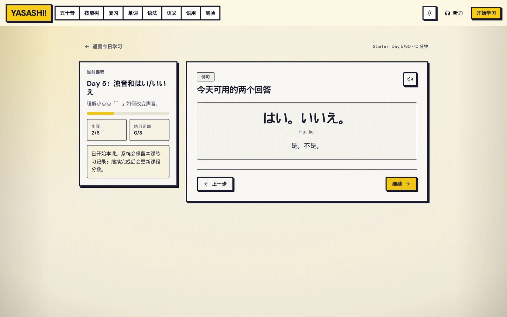
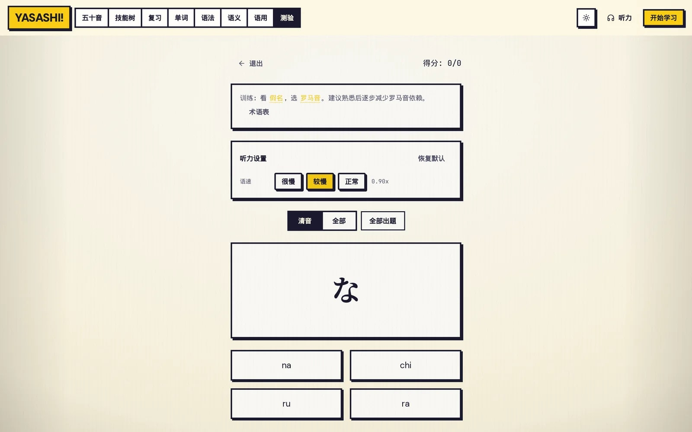
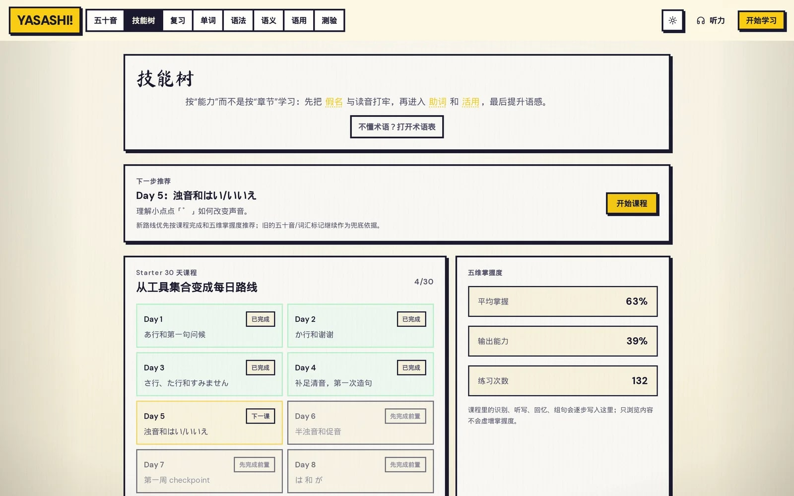
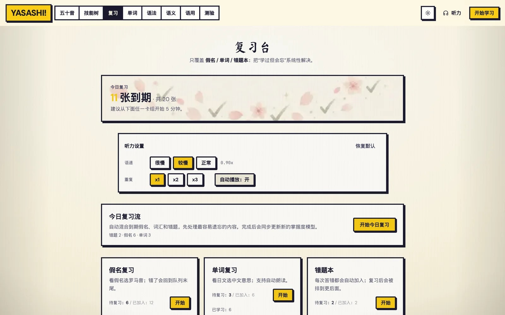

# Yasashi Japanese

Yasashi Japanese is a gentle Japanese learning app for beginners. It covers kana, vocabulary, grammar, semantic nuance, pragmatics, quizzes, a 30-day starter path, local progress tracking, SRS review, and a mistake notebook. Course practice, quiz practice, and review now share the same question/result rules so progress, SRS enrollment, and mistake recording stay consistent across pages.



*Home — a paper-style player with today's 30-day queue, daily goal, streak, and the next lesson to play.*


*Kana — hiragana and katakana charts with listening, romaji toggles, and mastery tracking.*



*Lesson — a guided day on the 30-day path, with examples, audio, and step progress.*



*Quiz — look at a kana, pick the reading; also covers particles, verbs, and vocabulary.*



*30-day path — starter days, next-lesson recommendation, and five-dimension mastery.*



*SRS review — today's mixed queue for due kana, vocabulary, and the mistake notebook.*

## Project Layout

- This Git repository is the Next.js app root. In the historical outer workspace it appears as `web/`.
- An optional parent folder may keep dependency-free convenience scripts that forward into this app; builds never depend on files outside this repository.
- Runtime and development dependencies belong in `package.json` and are locked by `package-lock.json`.
- Learning data lives under `src/data/`; vocabulary has a single source of truth in `src/data/vocabulary/*`.
- Data validation is self-contained in `scripts/validate-data.mjs`.

## Install And Run

From this app repository:

```bash
npm ci
npm run dev
```

The dev server defaults to `http://localhost:3000`.
When using the optional outer wrapper, run `npm ci --prefix web` once and use its forwarding scripts such as `npm run dev`.

## Verification

```bash
npm run validate:data  # data integrity, lesson refs, PWA/license files, legacy-source guard
npm run lint           # ESLint + Next/TypeScript rules
npm run test           # Node built-in unit tests
npm run build          # production Next build
npm run check          # validate:data + lint + test + build + HTTP smoke
npm run check:release  # check + strict browser/PWA Playwright E2E
npm run e2e            # HTTP smoke against an existing production build
npm run e2e:install    # install Playwright Chromium for browser/PWA E2E
npm run e2e:install:ci # install Playwright Chromium plus Linux system dependencies for CI
npm run e2e:browser    # optional real browser click-flow E2E on dev server; skips if Playwright is unavailable
npm run e2e:browser:required # strict browser E2E on production build/server; fails if Playwright is unavailable
npm run e2e:pwa        # optional production PWA/offline E2E; skips if Playwright is unavailable
npm run e2e:pwa:required # strict production PWA/offline E2E
```

The current merge gate is `npm run check`; after building, it starts that exact production artifact with `next start` on an isolated port for the HTTP smoke gate. The GitHub Actions workflow in `.github/workflows/quality.yml` runs this gate on push and pull request. It also has path-filtered strict gates for higher-risk browser behavior: learning-flow changes in routes, global styles, layout/theme components, lesson/kana/vocabulary/quiz/review/reference UI, shared question/progress/SRS/mistake logic, content data, build/config files, E2E harnesses, or package locks automatically provision Chromium with `e2e:install:ci` before running `npm run e2e:browser:required`; PWA-impacting changes such as service worker, manifest, offline fallback, app icons, public shell/assets, AnimCJK resources, app/layout/path/grammar/reference shells, build/config files, UI shell components, PWA registration/navigation, PWA E2E harness, or package lock changes run `npm run e2e:pwa:required`.

Use `npm run check:release` for release environments that have Playwright and its Chromium browser installed; it runs the merge gate plus strict browser click-flow and PWA/offline checks. The strict `npm run e2e:browser:required` release path builds the production app and runs the click-flow suite against `next start`, while the optional `npm run e2e:browser` command keeps using a dev server for faster local checks. Strict browser-backed E2E also fails on unexpected browser `pageerror`, `console.error`, and resource request failures, with narrow allowlists for normal Next.js navigation aborts and intentional offline/PWA aborts. The workflow also exposes a manual `workflow_dispatch` release run that provisions Chromium plus Linux system dependencies with `e2e:install:ci` before running `check:release`.

`npm run e2e` requires `.next/BUILD_ID` from `npm run build`, starts that production artifact with `next start` on an isolated available port, and verifies HTTP route health for the core top-level pages plus the first lesson. It never reuses the development server on port 3000. `npm run e2e:browser` exercises real interactions with Playwright, including lesson resume persistence, lesson answer recording, kana stroke playback, vocabulary search and transactional self-grading, filtered vocabulary modal behavior, dynamic vocabulary load-error retry recovery across quiz/vocabulary/review, quiz mistakes, review queue startup, PWA update refresh paths including waiting-worker `SKIP_WAITING`, and learning data backup/restore/reset. `npm run e2e:pwa` runs against a production build, waits for the service worker, simulates offline navigation, verifies the manifest and install icons online and offline, verifies the pre-cached home page, a previously visited lesson page, the learning path at `/path`, cached query deep links such as `/kana?set=yoon`, `/vocabulary?level=daily`, `/quiz?mode=hiragana-romaji`, and `/grammar?level=N5`, real cached kana/vocabulary/quiz/path/grammar/semantics/pragmatics content, a service-worker-controlled online navigation failure, and a real AnimCJK kana SVG can be served offline, and verifies the fallback page does not overwrite local learning state. Optional browser scripts exit cleanly with a skip message when the Playwright package or Chromium browser binary is missing. After `npm ci`, run `npm run e2e:install` to provision Chromium for local strict browser/PWA gates; in CI Linux runners use `npm run e2e:install:ci` so Playwright can install required system dependencies too. Use the `:required` variants or `check:release` in local release checks that must fail when the browser stack is missing.

The reference-page browser flow opens the first N5 grammar point, submits a wrong focused-practice answer, verifies the shared practice and mistake records in localStorage, and checks the completion state before continuing its keyboard-navigation assertions.

Builds may warn that `baseline-browser-mapping` or `caniuse-lite` data is stale. Treat that as dependency maintenance, not a functional failure. Actionable Next.js image performance warnings, such as full-width `sizes="100vw"` misuse or above-the-fold LCP artwork missing eager/priority loading, are blocked by `npm run build` so they cannot pass `npm run check`.

## Implemented Features

- Kana charts for hiragana/katakana, seion, dakuon, handakuon, yoon, and sokuon.
- Hiragana and katakana mastery are tracked independently with script-aware IDs such as `hiragana:a` and `katakana:a`. Existing localStorage keys are unchanged; legacy bare romaji IDs are read as the previously shared state for both scripts so existing progress is not lost.
- Kana page presentation is split into focused hero, set-hint, and section components while the page runner keeps URL controls, progress writes, and confirmation state.
- AnimCJK stroke-order animation loaded from `web/public/animcjk/kana`.
- Vocabulary cards grouped by level and category, with search, learned-state tracking, TTS, and three-way flashcard self-grading (`again` / `hard` / `good`). Self-grading records meaning practice and vocabulary SRS in one managed transaction without changing the learner's explicit mastered toggle or creating an objective mistake-notebook entry.
- Grammar, semantics, and pragmatics reference pages.
- Grammar reference keeps its static page shell server-rendered, with level selection, search, speech controls, modal navigation, and focused N5 practice sessions isolated in client components.
- Quiz modes for kana recognition, audio recognition, sokuon/long-vowel contrast, particles, verb conjugation, and vocabulary meaning.
- Local SRS review for kana, vocabulary, and mistakes, with today queue priority of mistakes first and due-time sorting for kana/vocabulary.
- A 30-day starter path with practice steps, step feedback, local progress, SRS enrollment for correct kana/vocab practice, and automatic mistake notebook capture for wrong answers. Days 1-14 cover partial kana plus survival phrases and core particles; days 15-30 complete all hiragana rows, dakuon, core yoon, katakana recognition, and additional N5 sentence patterns, with pure-review checkpoint lessons at day 20 and day 30.
- Vocabulary review questions rotate between meaning recognition, Chinese-to-Japanese recall, and audio-only listening directions; the today review queue is capped per session (mistakes first) so batch-marked words cannot flood a single review run.
- Survival greetings and high-frequency verbs ship with polite-form example sentences rendered on flashcards and in the vocabulary focus modal; the vocabulary toolbar can hide romaji to train direct kana reading.
- All 25 N5 grammar points include plain-language explanations, common-pitfall notes, and at least one focused recognition question in the grammar modal. Grammar answers use the shared question/result rules: every attempt updates practice progress, and wrong answers enter the mistake notebook without enrolling grammar into the kana/vocabulary SRS decks.
- The home page turns the onboarding minutes-per-day preference into a daily practice target with a progress bar based on today's recorded practice.
- Shared learning-session helpers in `web/src/lib/learning-session.ts` and shared question helpers in `web/src/lib/questions.ts`.
- Learning backup/restore/reset helpers in `web/src/lib/learning-store.ts`; storage keys remain compatible with existing localStorage data. New exports use backup schema v3, while v1/v2 backups remain importable and are normalized to script-aware kana state. Restore rejects unknown/non-string entries, invalid timestamps, malformed managed values, and files larger than 2 MB before mutation, then shows the backup time and data-category count and requires explicit confirmation. A valid empty backup is identified as destructive because confirming it clears current learning data.
- Learning backup export/import normalizes active kana/vocabulary indexes and SRS maps, removes stale vocabulary ids, non-reviewable kana ids, and mistake SRS entries that no longer have notebook records, while preserving practice history.
- Practice writes use the shared learning-store transaction helper so progress history, item mastery, SRS enrollment, and mistake notebook writes do not leave partial managed state after failures; this includes vocabulary flashcard self-grading. `again` schedules immediate review, `hard` shortens an advanced interval by one box without incrementing SRS right/wrong counters, and `good` advances recall mastery. Learning-store replacement events are broadcast across tabs so active review sessions stop before writing against replaced data.
- Incremental learning writes distinguish missing storage from unreadable, invalid, or structurally empty-corrupt values. They refuse to overwrite an untrusted value and compare the raw read snapshot before persistence; explicit restore/reset/confirmed clear actions remain the recovery path for replacing invalid local data. Partial rollback failures still broadcast a resync event so mounted learning hooks reload the final browser state.
- User mastery choices take precedence over scores derived from practice. Two additive exclusion keys let learners explicitly mark a derived kana or vocabulary item as not mastered without deleting practice history; the exclusions participate in backup, restore, reset, and cross-tab synchronization.
- Quiz and review routes use shared runner components plus pure question builders, so the route files stay focused on URL/session entry state.
- AnimCJK rendering is split into parser/timeline helpers (`web/src/lib/animcjk.ts`) and a glyph-board component, keeping SVG parsing testable outside React; the stroke animation component is lazy-loaded from the kana detail modal.
- Dynamic vocabulary loading helpers (`loadVocabularyLevel`, `loadVocabularyScope`) live in `web/src/data/vocabulary/loader.ts`; import that module when a route can avoid loading every level at once.
- Basic PWA installability via `manifest.webmanifest` with a stable `/` app id, 192/512 app icons, and a production service worker with separate shell, navigation, and bounded runtime-media caches. After a first install gains a controller, the client warms the current page's same-origin scripts, styles, and images so a second online reload is not required. Navigation waits at most four seconds for the network before trying the exact visited-page cache, then a canonical pathname cache for query deep links such as `/kana?set=yoon` -> `/kana`, `/vocabulary?level=daily` -> `/vocabulary`, `/quiz?mode=hiragana-romaji` -> `/quiz`, and `/grammar?level=N5` -> `/grammar`; if no cached page exists, it serves `/offline.html` instead of pretending an unknown route is available. Service-worker-controlled app links use document navigation as a fallback even when the browser reports online, so failed app-router fetches can still be recovered by the service worker. Learning state stays in `localStorage` and is not cached by the service worker. The PWA E2E verifies a lesson reached through the app's real home link can later be opened offline and that cached kana, vocabulary, quiz, path, grammar, semantics, pragmatics, and AnimCJK content still renders while offline.
- A dedicated offline fallback page at `/offline.html` for navigation requests that have not been visited/cached before the network is unavailable.

## Extending Content

- Add vocabulary to `web/src/data/vocabulary/survival.ts`, `daily.ts`, or `fluent.ts`.
- Add grammar to `web/src/data/grammar-data.ts`. Every N5 grammar point must also have a matching entry in `n5GrammarPracticeSets`; template ids, prompts, answers, and at least two unique options are required, and the answer must appear in the options.
- Add lesson steps to `web/src/data/lessons.ts` and run `npm run validate:data`.
- Practice steps should include stable `itemId`, `itemType`, and `mode` fields so progress/SRS/mistake recording can identify the learned item.
- Reviewable kana practice uses `hiragana:<romaji>` or `katakana:<romaji>` item IDs. Phonology exercises that represent a whole word, such as `sokuon:きって`, keep their scoped custom IDs and do not enroll the single-kana SRS deck.
- Do not recreate `web/src/data/vocab-data.ts`, `kanaHira.json`, or `kanaKata.json`; validation fails if those legacy sources return.

## Assets And Licenses

AnimCJK SVG files are stored in `web/public/animcjk/`. Keep `web/public/animcjk/licenses/` when distributing the app.
